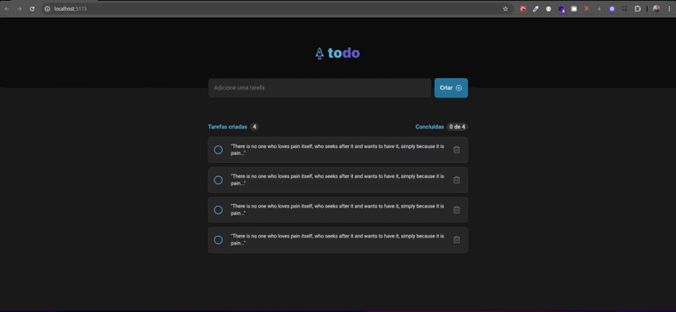

# 🚀 Todo Enablers

A **React + TypeScript** to-do app refactored with clean-code principles, localStorage persistence and full test coverage using **Jest + React Testing Library**.

---

## Overview

This project started as a bug-ridden legacy codebase and was incrementally refactored to showcase strong typing, responsive UI, and automated tests.


---
## Installation


```bash
git clone https://github.com/FranciscoGabriel1/todo-enablers-francisco.git
cd todo-enablers-francisco
yarn          # install dependencies
yarn dev      # dev server at http://localhost:5173
```

## Tests
> Run the full Jest suite once
```bash
yarn test
```
> Watch mode (re-runs on every file change)
```bash
yarn test:watch
```

## Features

| Module          | Description                                                          |
| --------------- | -------------------------------------------------------------------- |
| **Add Task**    | Input field + “Create” button, empty-title validation                |
| **Task List**   | Card with checkbox, title and delete button                          |
| **Toggle**      | Click checkbox to mark / unmark and update counters                  |
| **Delete**      | Remove a task and persist new state                                  |
| **Persistence** | Saves list in `localStorage` (`todo-ts/tasks`)                       |
| **Responsive**  | Works down to 320 px without horizontal scroll                       |
| **Testing**     | Components and main flow covered by Jest + RTL                       |

---

## Tech Stack

| Tool                     | Version |
| ------------------------ | ------- |
| React                    | 18      |
| TypeScript               | 5       |
| Vite                     | 5       |
| Jest                     | 29      |
| React Testing Library    | 14      |

---

## Requirements

- **Node 16+**
- **Yarn 1.22+**

---


